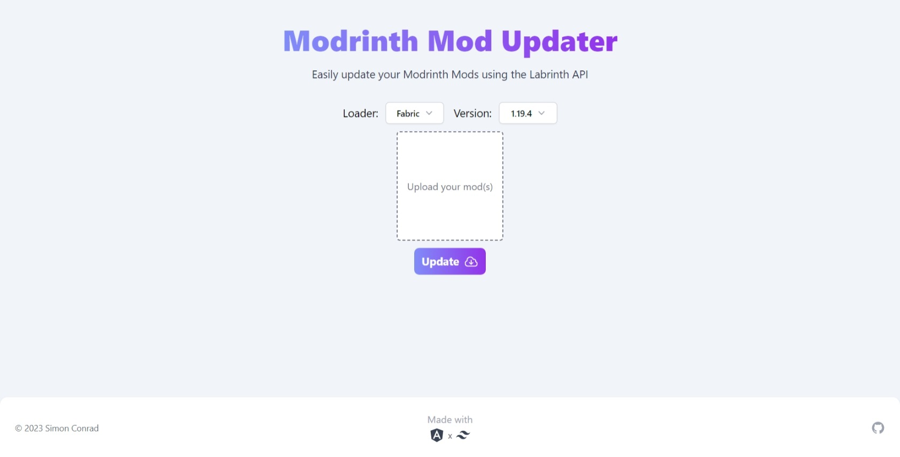

# Minecraft Mod Updater

A Minecraft Java mod updater and migrator using the Modrinth & Curseforge API build with [Angular](https://angular.io/).
Visit the latest deployment [here](https://mc-mod-updater.vercel.app/).

## Features

Allows you to update or migrate your mods via simple drag and drop or file upload (.jar).
You may select the version and loader you want to search updates for or migrate to.
Returns a list of all available version files of your mods and lets you download them.

## Screenshot

## Contributors

- [@orangishcat](https://github.com/orangishcat) - Add predefined URLs to update mods from GitHub [#13](https://github.com/IsAvaible/AngularModUpdater/pull/13)

Want to contribute? Check out the [CONTRIBUTING.md](CONTRIBUTING.md) guide.
